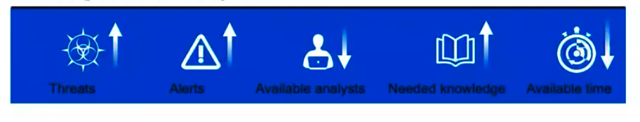
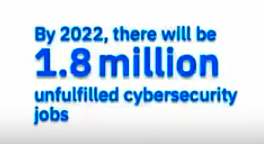
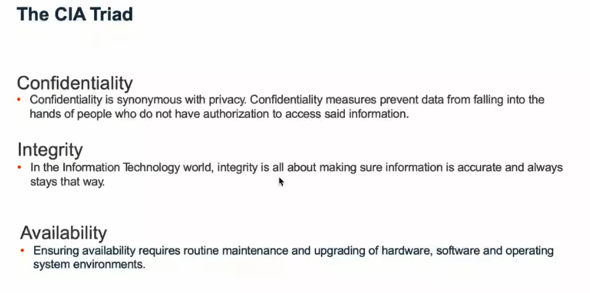
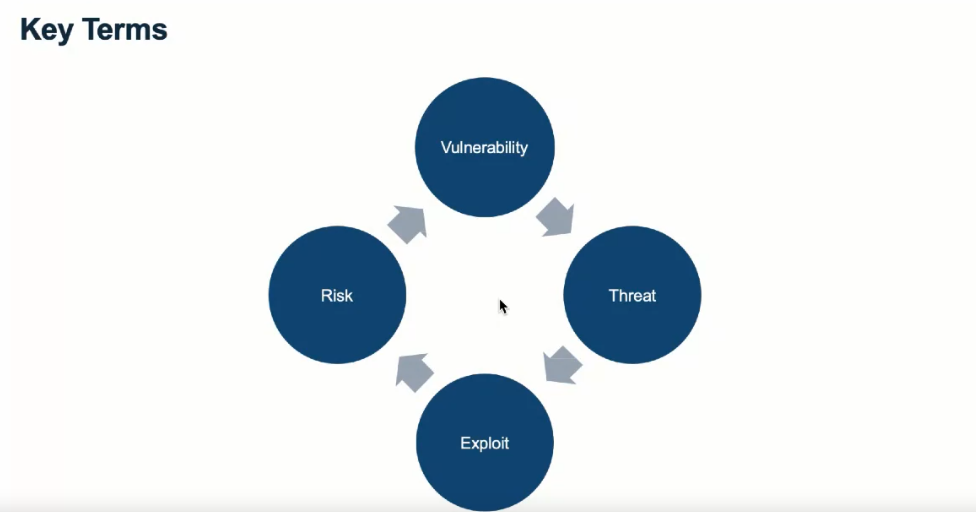
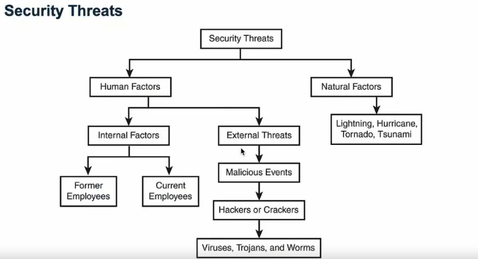
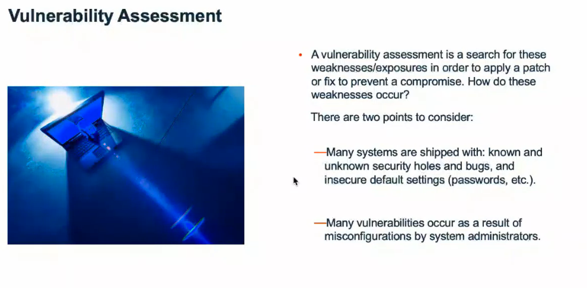
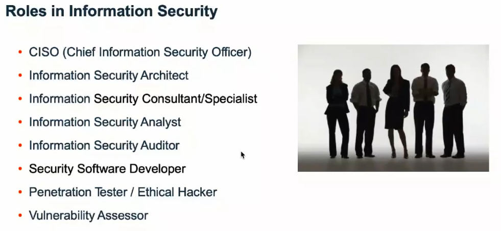
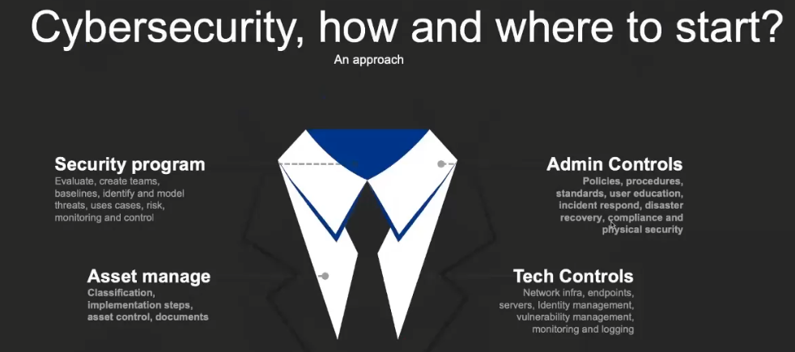

<!-- START doctoc generated TOC please keep comment here to allow auto update -->

<!-- DON'T EDIT THIS SECTION, INSTEAD RE-RUN doctoc TO UPDATE -->

**Table of Contents**   

- [Introduction To CyberSecurity Tools & Cyber Attacks](#introduction-to-cybersecurity-tools--cyber-attacks)
  - [Today's CyberSecurity  Challenge](#todays-cybersecurity--challenge)
- [What are We Talking about When We Talk about Cybersecurity?](#what-are-we-talking-about-when-we-talk-about-cybersecurity)
  - [Cybersecurity definition](#cybersecurity-definition)
  - [Key Terms](#key-terms)
  - [Security Threats](#security-threats)
  - [Vulnerability Assessments](#vulnerability-assessments)
  - [Role in Security](#role-in-security)
- [Cybersecurity Programs](#cybersecurity-programs)
- [Top Cybersecurity Organizations](#top-cybersecurity-organizations)

<!-- END doctoc generated TOC please keep comment here to allow auto update -->

# Introduction To CyberSecurity Tools & Cyber Attacks

## Today's CyberSecurity  Challenge

From the process we can realize that:

To deal with threats we need The SOC (Security Operation Center) that's the control center.

[IBM Global Subject Matter Experts](https://d3c33hcgiwev3.cloudfront.net/deHBQ5nPEem6SAq8ilBGGg_741bbdfe17884efb88e59dfe71281303_Your-IBM-Subject-Matter-Experts--Intro-to-Cybersecurity-tools.pdf?Expires=1659571200&Signature=XjP22ijhLH-29JXpRn6CLMFTaMZ46X~T6nEnl-vFq9lvy3BzRRyhcw~IcNXMxbiLWPjqKMY0sWIGIXQFOAYsIKvss~RF7P~h2vWmsijANmhpwT~42jNaaPrtCtsw97lLeec6dv9V-zO7B-aJpkQEoYQu56ZRNUdFDXLBcD97Hts_&Key-Pair-Id=APKAJLTNE6QMUY6HBC5A)

# What are We Talking about When We Talk about Cybersecurity?

## Cybersecurity definition

- Definiton an the CIA Triad
  
  Information Security: 
  
  According to NIST it is "**The protection of  information systems from unauthorized activities in order to provide confidentiality, integrity and availability. These three principles are known as the CIA Triad.**"
  
  The CIA Triad here.
  
  
  
  

## Key Terms

- Vulnerability
  
  A flaw, loophole, oversight, ot the error that can be exploited to violate system security policy.

- Threat
  
  A threat is an event, natural or man-made, able to cause negative impact to an organization.

- Exploit 
  
  An exploit is a defined way to breach the security of an IT system through a vulnerability.

- Risk
  
  It's a situation involving exposure to danger.

## Security Threats

## Vulnerability Assessments

## Role in Security

# Cybersecurity Programs

[The Insane Amounts of Data We're Using Every Minute (Infographic)](https://www.entrepreneur.com/article/314672)

# Top Cybersecurity Organizations

- [The SANS Institute](https://www.sans.org/)

- [Category:OWASP Project - OWASP](https://wiki.owasp.org/index.php/Category:OWASP_Project#tab=Project_Inventory)

- [ISSA - Information Systems Security Association](https://www.issa.org/)

- [FIRST Services Framework](https://www.first.org/standards/frameworks/)

- [List of Cybersecurity Associations and Organizations](https://cybersecurityventures.com/cybersecurity-associations/#home/?view_1_page=1[List%20of%20Cybersecurity%20Associations%20and%20Organizations](https://cybersecurityventures.com/cybersecurity-associations/)
