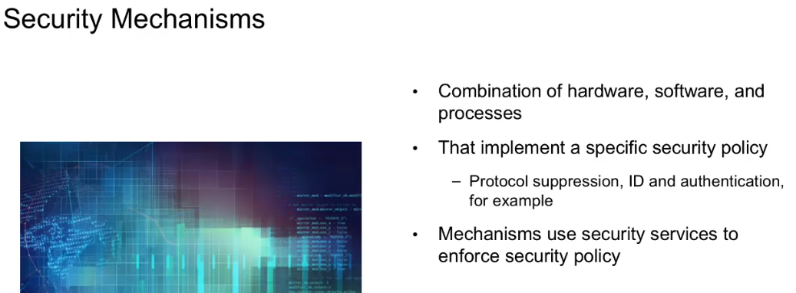

<!-- START doctoc generated TOC please keep comment here to allow auto update -->
<!-- DON'T EDIT THIS SECTION, INSTEAD RE-RUN doctoc TO UPDATE -->
**Table of Contents**   

- [Type of actors and their motives](#type-of-actors-and-their-motives)
  - [A brief overview of types of actors and their motives](#a-brief-overview-of-types-of-actors-and-their-motives)
- [An Architect's perspective on attack classifications](#an-architects-perspective-on-attack-classifications)
  - [Security Attack Definition](#security-attack-definition)
  - [Security Services](#security-services)
  - [Security Mechanisms](#security-mechanisms)
  - [Network security model](#network-security-model)
  - [Organizational Threats](#organizational-threats)
  - [Security Architecture - Attack models](#security-architecture---attack-models)
- [Malware and an introduction to threat Ransomware.](#malware-and-an-introduction-to-threat-ransomware)
  - [What is malware?](#what-is-malware)
  - [Threat Protection](#threat-protection)
- [Attack Examples today](#attack-examples-today)
  - [Internet Security Threats - Mapping](#internet-security-threats---mapping)
  - [Internet Security Threats - Packet Sniffing](#internet-security-threats---packet-sniffing)
  - [Security Threat - IP Spoofing](#security-threat---ip-spoofing)
  - [Security Threats - Denial of service](#security-threats---denial-of-service)
  - [Security Attacks - Host insertions](#security-attacks---host-insertions)
  - [Some of the remaining security threats](#some-of-the-remaining-security-threats)
- [Attacks and Cybers Crime Resources](#attacks-and-cybers-crime-resources)
  - [The Cyber Kill Chain](#the-cyber-kill-chain)
  - [What is Social Engineering?](#what-is-social-engineering)
    - [Phishing vs Vishing](#phishing-vs-vishing)
  - [Cyberwarfare](#cyberwarfare)
  - [Cybercrime Resources](#cybercrime-resources)
- [X-Force Command Center and threat intelligence tools](#x-force-command-center-and-threat-intelligence-tools)
  - [X-Force Research](#x-force-research)

<!-- END doctoc generated TOC please keep comment here to allow auto update -->

# Type of actors and their motives

## A brief overview of types of actors and their motives

[2019 Ponemon Institute Study on the Cyber Resilient Organization](https://www.ibm.com/account/reg/us-en/signup?formid=urx-37792&cm_mmc=Search_Google-_-Security_Resilient-_-WW_NA-_-%2Bponemon%20%2Binstitute_b_OV64453&cm_mmca1=000024FH&cm_mmca2=10006542&cm_mmca7=9021964&cm_mmca8=kwd-294934641027&cm_mmca9=_k_EAIaIQobChMI5OLK2tv_4QIVDp7ACh1sHwNWEAAYASAAEgL2w_D_BwE_k_&cm_mmca10=326203471649&cm_mmca11=b&gclid=EAIaIQobChMI5OLK2tv_4QIVDp7ACh1sHwNWEAAYASAAEgL2w_D_BwE)

# An Architect's perspective on attack classifications

## Security Attack Definition

| **Passive attacks**                                                                                                                                                                                                                                                       | Active attacks                                                                                                                                                                                                                                                                                |
|:------------------------------------------------------------------------------------------------------------------------------------------------------------------------------------------------------------------------------------------------------------------------- | --------------------------------------------------------------------------------------------------------------------------------------------------------------------------------------------------------------------------------------------------------------------------------------------- |
| - Essentially interception and modification. - Second class is traffic analysis. - Passive attack is hard to detect.   | - Explitcit interception and modification. - Several classes of these attacks exist:[Masquerade, Replay, Modification, DOS].   |

## Security Services

[Security Services - YouTube](https://www.youtube.com/watch?v=bRgL_Dry7uw&list=PLBlnK6fEyqRhBsP45jUdcqBivf25hyVkU&index=5)

## Security Mechanisms

[Security Mechanisms - YouTube](https://www.youtube.com/watch?v=H5ifNVeDXkg&list=PLBlnK6fEyqRhBsP45jUdcqBivf25hyVkU&index=6)

## Network security model

Four tasks in designing a particular security service:

1. Design an algorithm for performing the security-related transformation.
2. Generate the secret information to be used with the algorithm.
3. Develop methods for the distribution and sharing of secret information.
4. Specify a protocol to be used by the two principals that make use of the security algorithm and the secret information to achieve a particular security service.

## Organizational Threats

## Security Architecture - Attack models

[Security Attacks - YouTube](https://www.youtube.com/watch?v=yIm0Ol9Dg4Y&list=PLBlnK6fEyqRhBsP45jUdcqBivf25hyVkU&index=4)

# Malware and an introduction to threat Ransomware.

## What is malware?

Malware, or malicious software, is any program or file that is intentionally harmful to a computer, network or server.

[ransomware](https://www.techtarget.com/searchsecurity/definition/ransomware)

## Threat Protection

# Attack Examples today

## Internet Security Threats - Mapping

## Internet Security Threats - Packet Sniffing

## Security Threat - IP Spoofing

## Security Threats - Denial of service

## Security Attacks - Host insertions

## Some of the remaining security threats

# Attacks and Cybers Crime Resources

## The Cyber Kill Chain

## What is Social Engineering?

As an effective method of cyber exploitation.

[GitHub - trustedsec/social-engineer-toolkit: The Social-Engineer Toolkit (SET) repository from TrustedSec - All new versions of SET will be deployed here.](https://github.com/trustedsec/social-engineer-toolkit)

### Phishing vs Vishing

[ Open-Source Phishing Framework Gophish is a powerful, open-source phishing framework that makes it easy to test your organization's exposure to phishing.](https://getgophish.com/)

Vishing is the method that An attacker try to get more or trick the IT guy.

## Cyberwarfare

[Significant Cyber Incidents | Center for Strategic and International Studies](https://www.csis.org/programs/strategic-technologies-program/significant-cyber-incidents)

## Cybercrime Resources

# X-Force Command Center and threat intelligence tools

## X-Force Research

As threats multiply and increase in sophistication, it is more important than ever that organizations maintain awareness of current security trends.

IBM X-Force Threat Intelligence research reports can help you keep pace with an evolving threat landscape and learn how to protect your networks and data from the latest threats and attack vectors. Current reports are available for download, using the links below.

In 2018, many organizations across all industries faced unmanageable levels of cyberthreats brought on by the changing threat landscape, the risk of exposure, and an ever-growing attack surface. The optimum strategy to respond to this combination of factors is to make security an integral part of culture and overall structure. To help organizations better prepare for this landscape, IBM® Security has developed the X-Force® Threat Intelligence Index 2019 report to provide insight on cybersecurity issues, including what the most common types of attacks are and where they come from.

The IBM X-Force Threat Intelligence Index 2019 examined numerous cyber threats that shaped the threat landscape in 2018 and will continue to have an impact in 2019. According to the report, cybercriminals are moving away from malware-based attacks and instead abusing operating system tools to achieve their goals.

Download the full IBM X-Force Threat Intelligence Index 2019 to discover how to keep pace with the changing threat landscape and:

- Analyze top targeted industries and changes year over year

- Explore how cyber criminals are using operating system tools to get control

- Uncover why cyber criminals are changing their techniques to gain illegal profits

- Determine what steps you can take to protect your organization against these threats

IBM Security analyzes data and insight derived from monitored security clients, incident response services and penetration testing engagements. X-Force also runs spam traps around the world and monitors tens of millions of spam and phishing attacks daily. It analyzes billions of web pages and images to detect fraudulent activity and brand abuse

Download the 2019 X-Force Threat Intelligence Index 2019 if you have not already done so from the resource section of a previous lesson. Read the report and keep as a reference guide throughout your Cybersecurity training.

[X-Force Threat Intelligence Index](https://www.ibm.com/security/data-breach/threat-intelligence/)

Download and read two industry reports that interest you from X-Force Research to understand the attack threats and recommended mitigation for that industry as found by the subject matter experts.

[X-Force Threat Intelligence Index](https://www.ibm.com/security/data-breach/threat-intelligence/)

