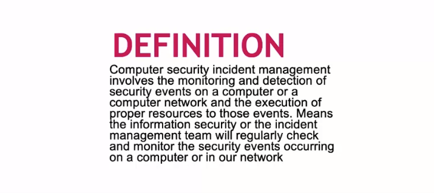
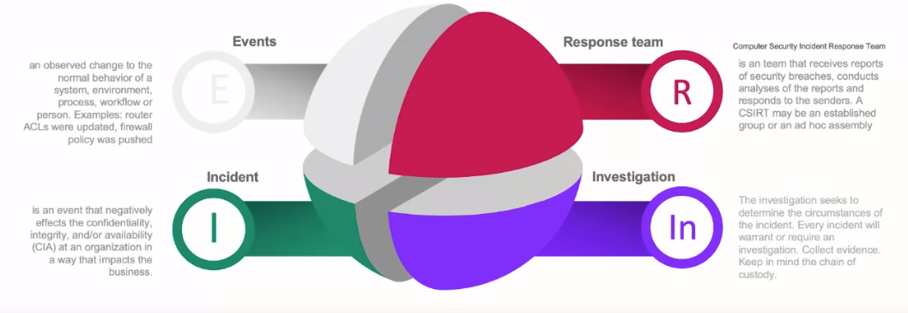
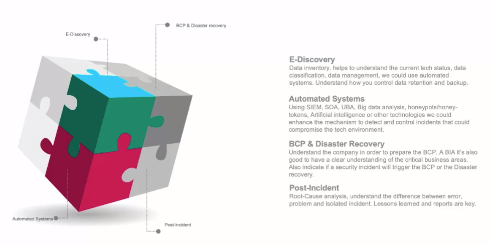

<!-- START doctoc generated TOC please keep comment here to allow auto update -->
<!-- DON'T EDIT THIS SECTION, INSTEAD RE-RUN doctoc TO UPDATE -->
**Table of Contents**   

- [CIA Triad vs Access Management](#cia-triad-vs-access-management)
- [Incident Response](#incident-response)
  - [What it is?](#what-it-is)
  - [Incident Management | Key Components](#incident-management--key-components)
  - [Key Concepts | To understand Security Incident response](#key-concepts--to-understand-security-incident-response)
  - [Incident Response Process](#incident-response-process)
- [Frameworks and their purpose](#frameworks-and-their-purpose)
  - [OWASP Top 10 Project Findings 2021](#owasp-top-10-project-findings-2021)
  - [OWASP Top 10 Most Critical Web Application Security Risks](#owasp-top-10-most-critical-web-application-security-risks)
- [NIST, The US National Institute for Standards and Technology](#nist-the-us-national-institute-for-standards-and-technology)
  - [National Institute of Standards & Technology](#national-institute-of-standards--technology)
  - [National Initiative For Cybersecurity Education](#national-initiative-for-cybersecurity-education)
  - [Computer Security Incident Handling Guide](#computer-security-incident-handling-guide)

<!-- END doctoc generated TOC please keep comment here to allow auto update -->

# CIA Triad vs Access Management

- [CIA](./Videos/CIA)

- [Access Management](./Videos/Access%20Management)

# Incident Response

## What it is?

## Incident Management | Key Components

## Key Concepts | To understand Security Incident response

## Incident Response Process

[CSIR-Maturity](https://www.crest-approved.org/wp-content/uploads/2022/04/CSIR-Maturity-assessment-tool_Info1.pdf)

[Incident Response and Handling Steps | MindMeister](https://www.mindmeister.com/591683277/incident-response-and-handling-steps?fullscreen=1#)

[Computer Incidient Response Plan | MindMeister](https://www.mindmeister.com/1238203018/computer-incidient-response-plan?fullscreen=1)

# Frameworks and their purpose

**Listen Carefully**

Video01

    [Introduction to Frameworks and Best Practices](./Videos/Frameworks) #IntroFrameworks.mp4

Video02

    [IT Governance Process](./Videos/Frameworks) # ITGovernanceProcess.mp4

Video03

     [Cybersecurity Compliance and Audit Overview](./Videos/Frameworks) # ComplianceVSAuditOverview.mp4

Video04

    [Pentest Process and Mile 2 CPTE Training](./Videos/Frameworks) # PESTvsCPTE.mp4

    [https://www.mile2.com/penetration-testing-engineer-outline/](https://www.mile2.com/penetration-testing-engineer-outline/)

Video05

    [OWASP framework](./Videos/Frameworks) # OWASP.mp4

    [OWASP Top Ten (2013) | OWASP Foundation](https://www.owasp.org/index.php/Category:OWASP_Top_Ten_Project#OWASP_Top_10_for_2013)

    [OWASP Mobile Top 10 | OWASP Foundation](https://owasp.org/www-project-mobile-top-10/)

## OWASP Top 10 Project Findings 2021

2121The Open Web Application Security Project (OWASP) is an open community dedicated to enabling organizations to develop, purchase, and maintain applications and APIs that can be trusted.

## OWASP Top 10 Most Critical Web Application Security Risks

The OWASP Top 10 is a powerful awareness document for web application security. It represents a broad consensus about the most critical security risks to web applications. Project members include a variety of security experts from around the world who have shared their expertise to produce this list.

We urge all companies to adopt this awareness document within their organization and start the process of ensuring that their web applications minimize these risks. Adopting the OWASP Top 10 is perhaps the most effective first step towards changing the software development culture within your organization into one that produces secure code.

Review the NEW Top 10 Project Findings for 2021

[OWASP Top 10:2021](https://owasp.org/Top10/ "owasp top10") 

# NIST, The US National Institute for Standards and Technology

## National Institute of Standards & Technology

Go to the National Institute of Standards & Technology (NIST) website and review all the resources available to you around Cybersecurity.

[https://www.nist.gov/](https://www.nist.gov/)

Navigate to publications and select Cybersecurity. Review two publications on Cybersecurity to understand how you might find resources in the future on a specific topic.

## National Initiative For Cybersecurity Education

Review the resources made available to you from the National Initiative for Cybersecurity Education (NICE).

[National Initiative for Cybersecurity Education (NICE) | NIST](https://www.nist.gov/itl/applied-cybersecurity/nice)

Check out the News, Events and Resources available as part of this US Government initiative.

Look at the past and present webinars to see if any interest you and check back often to review specific topics you made need to further your skill development in cybersecurity.

## Computer Security Incident Handling Guide

Look at the Table of contents of this important guideline from NIST on Incident Handling which we learned about earlier in this module. NIST has prepared several guides to assist organizations with their policies and procedures around Cybersecurity.

Read Chapter 2: Organizing a Computer Security Incident Response Capability

[http://nvlpubs.nist.gov/nistpubs/SpecialPublications/NIST.SP.800-61r2.pdf](http://nvlpubs.nist.gov/nistpubs/SpecialPublications/NIST.SP.800-61r2.pdf "NIST")
