<!-- START doctoc generated TOC please keep comment here to allow auto update -->
<!-- DON'T EDIT THIS SECTION, INSTEAD RE-RUN doctoc TO UPDATE -->
**Table of Contents**   

- [Firewalls](#firewalls)
  - [What Firewalls do!](#what-firewalls-do)
  - [Types of attacks Firewall can shield a network from](#types-of-attacks-firewall-can-shield-a-network-from)
  - [Types of Firewall](#types-of-firewall)
  - [Firewall - Stateless and Stateful](#firewall---stateless-and-stateful)
- [Antivirus/Antimalware](#antivirusantimalware)
- [Introduction to Crytography](#introduction-to-crytography)
- [Frist look ar Penetration Testing and Digital Forensics](#frist-look-ar-penetration-testing-and-digital-forensics)
- [Resource review - Securityintelligence.com](#resource-review---securityintelligencecom)
  - [Securityintelligence.com](#securityintelligencecom)
  - [Incident Response and Digital Forensics: Will You Buy or Build?](#incident-response-and-digital-forensics-will-you-buy-or-build)
    - [Incident Response and Digital Forensics: Will You Buy or Build?](#incident-response-and-digital-forensics-will-you-buy-or-build-1)

<!-- END doctoc generated TOC please keep comment here to allow auto update -->

# Firewalls

## What Firewalls do!

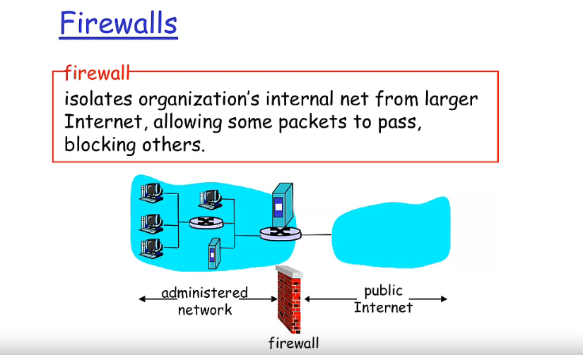

## Types of attacks Firewall can shield a network from

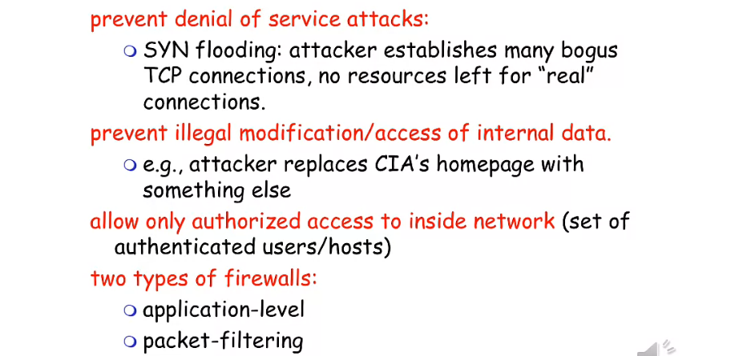

## Types of Firewall

**`Packet Filtering`**

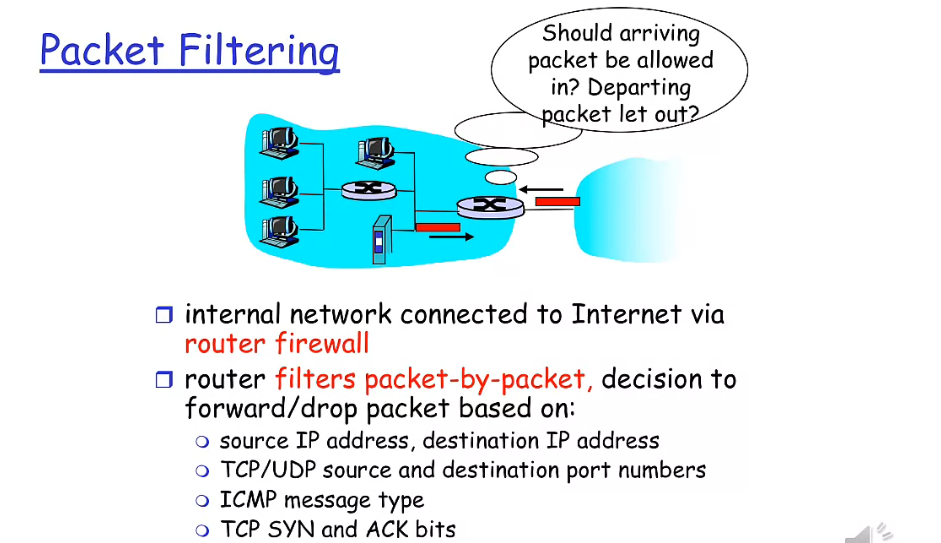

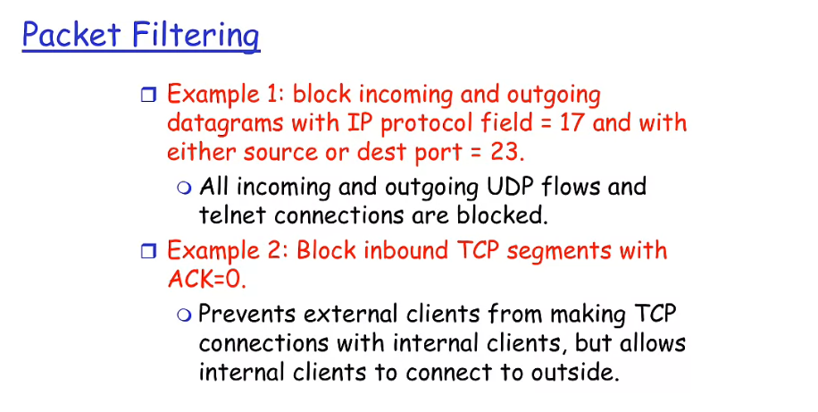

**`Application-level`**

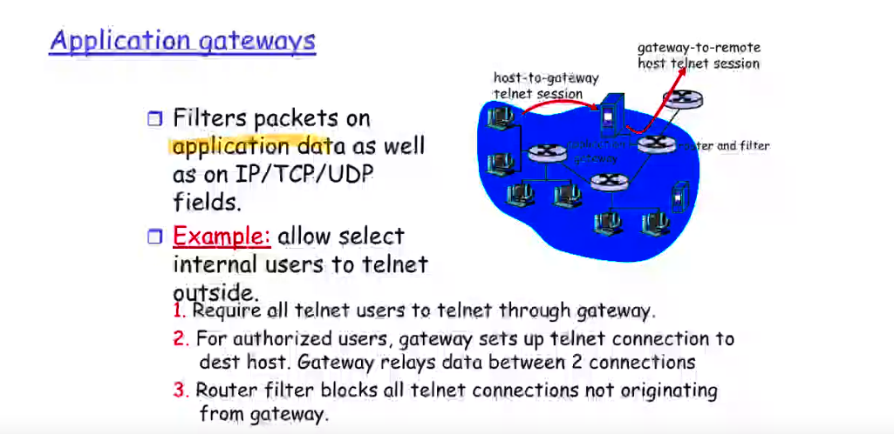

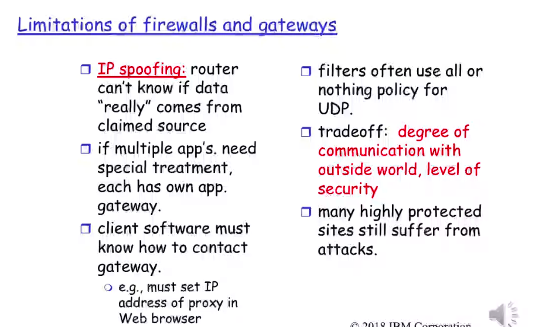

**`XML Gateway`**

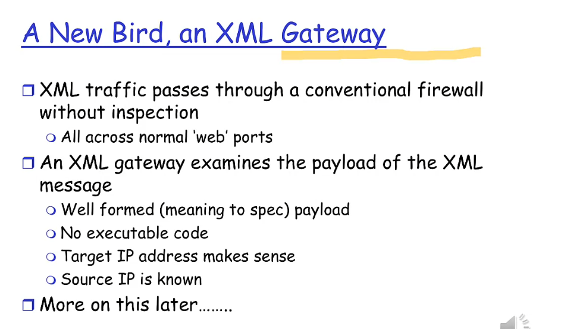

## Firewall - Stateless and Stateful

**`Overview again firewall`**

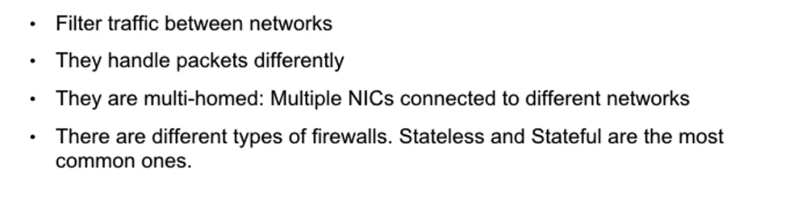

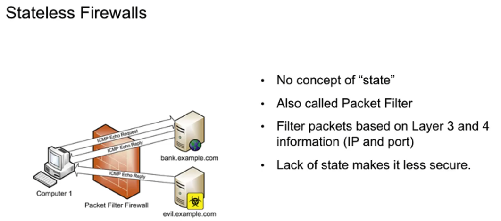

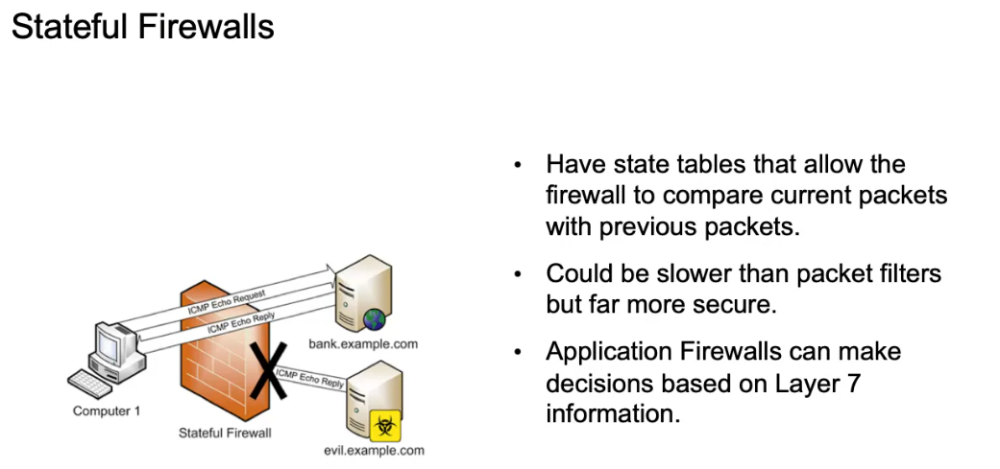

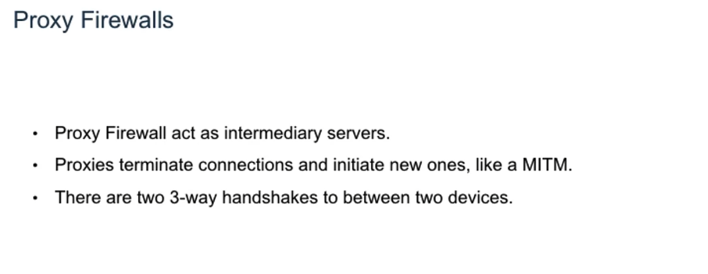

# Antivirus/Antimalware

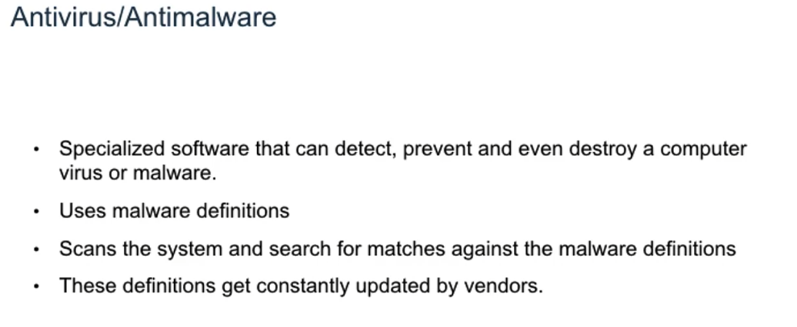

[How antivirus and antimalware programs detect, block and remove viruses and malware from infected systems. Also The purpose of the malware definitions or signatures](./videos/Anti)

# Introduction to Crytography

**`# Introduction of Crytography`**

    [An introduction of Cryptography](./videos/Cryto) # IntroCryto.mp4

**`# Types of Cryptography`**

    [Types of Cryptography](./videos/Cryto) # TypesofCryptography.mp4

**`# Cryptographic Attacks`**

    [Cryptographic Attacks](./videos/Cryto) # CryptographicAttacks.mp4

**`# Cryptography - a different perspective from a Security architect`**

    [different perspective from a Security architect](./videos/Cryto) # DifferentPerspective.mp4

# Frist look ar Penetration Testing and Digital Forensics

**`# Penetration Testing Introduction`**

    [Pentest Introduction](./videos/intro-PEST-DF) # introPEST.mp4

**`# Pentest Methodologies`**

    [Pentest Methodologies](./videos/intro-PEST-DF) # PESTMethods.mp4

    // List link in PESTMethods.mp4:

        [https://mile2.com/penetration-testing-ethical-hacking/cpte.html](https://mile2.com/penetration-testing-ethical-hacking/cpte.html)

        [http://www.isecom.org/](http://www.isecom.org/)

        [CSRC Presentations | CSRC](https://csrc.nist.gov/Presentations/2013/Security-Testing,-Validation-Measurement)

        [https://ithandbook.ffiec.gov/](https://ithandbook.ffiec.gov/)

        [PTES Technical Guidelines - The Penetration Testing Execution Standard](http://www.pentest-standard.org/index.php/PTES_Technical_Guidelines)

**`# Vulnerability Tests`**

    [Vulnerability Tests](./videos/intro-PEST-DF) # VulTest.mp4

    // Link in VulTest.mp4

        [http://www.letsrespondtoolkit.org/vulnerability-assessment](http://www.letsrespondtoolkit.org/vulnerability-assessment)

**`# What is Digital Forensics?`**

    [What is Digital Forensics?](./videos/intro-PEST-DF) # DF.mp4

# Resource review - Securityintelligence.com

## Securityintelligence.com

Explore [https://securityintelligence.com/](https://securityintelligence.com/) to review all of the up to date information contributed by Cybersecurity experts globally.

At *SecurityIntelligence*, they empower security professionals across the globe to protect their organizations by providing them with the relatable analysis and actionable insights they need to thrive in the face of cyber uncertainty. This site delivers content from hundreds of the brightest minds in the cybersecurity industry.

Read one article or blog from each of the securityintelligence topic areas:

·      News (Current events involving cybersecurity threats and breaches)

·      Series (Reoccurring podcasts, articles and videos from a specific group within cybersecurity)

·      Topics (Search information on cybersecurity topics such as Fraud protection, Application security, etc)

·      Industries (Search information by industry such as banking, healthcare, etc)

·      Threat Research (Cybersecurity experts discuss key trends and topics)

·      Podcast (Cybersecurity experts record podcasts to discuss key cybersecurity topics)

·      Events (Sign up for a future webcast or explore an on demand webcast)

## Incident Response and Digital Forensics: Will You Buy or Build?

Review the article from Warren on Securityintelligence.com where he discusses Incident Response and Digital Forensics.

### Incident Response and Digital Forensics: Will You Buy or Build?

June 6, 2018  |  By Warren Perez Araya

https://securityintelligence.com/incident-response-and-digital-forensics-will-you-buy-or-build/
