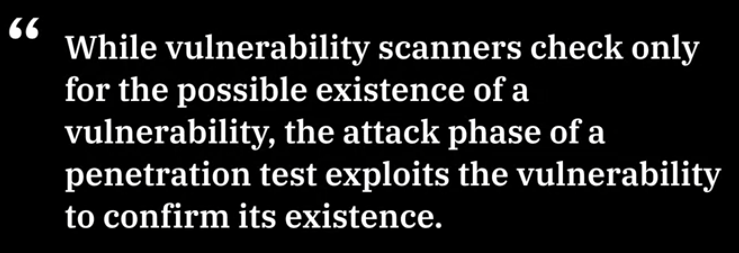

<!-- START doctoc generated TOC please keep comment here to allow auto update -->
<!-- DON'T EDIT THIS SECTION, INSTEAD RE-RUN doctoc TO UPDATE -->
**Table of Contents**   

- [Introduction to Penetration Testing](#introduction-to-penetration-testing)
  - [What is Penetration Testing?](#what-is-penetration-testing)
  - [What is the importance of pentesting?](#what-is-the-importance-of-pentesting)
  - [Operating Systems](#operating-systems)
- [Penetration Testing Phases](#penetration-testing-phases)
  - [1. Planning](#1-planning)
  - [2. Discovery](#2-discovery)
    - [2.1 What vulnerability analysis and its role in pentesting?](#21-what-vulnerability-analysis-and-its-role-in-pentesting)
    - [2.2 Different methods of gathering information.](#22-different-methods-of-gathering-information)
    - [2.3 What role sosical engineering  plays in discovering  information?](#23-what-role-sosical-engineering--plays-in-discovering--information)
    - [2.4 Different scanning tools.](#24-different-scanning-tools)
    - [2.5 Additional Discovery Details](#25-additional-discovery-details)
      - [2.5.1 Different methods of gaining access to a system](#251-different-methods-of-gaining-access-to-a-system)
  - [3. Attack](#3-attack)
  - [4. Reporting](#4-reporting)
- [Penetration Testing Tools](#penetration-testing-tools)

<!-- END doctoc generated TOC please keep comment here to allow auto update -->

# Introduction to Penetration Testing

## What is Penetration Testing?

According to NIST defines:

## What is the importance of pentesting?

## Operating Systems

# Penetration Testing Phases

## 1. Planning

Visit the [following link](https://hub.packtpub.com/penetration-testing-rules-of-engagement/) to review the differences between a Black, White, and Grey Hat approach to penetration testing. Make sure to read the sections on Rules of Engagement and Scope. After reviewing the article, visit the [Sans Institute](https://pen-testing.sans.org/resources/downloads) site where you can sign up to access various documents relating to penetration testing. Download and review the Scope and the Rules of Engagement (RoE) worksheets.

## 2. Discovery

### 2.1 What vulnerability analysis and its role in pentesting?

### 2.2 Different methods of gathering information.

### 2.3 What role sosical engineering  plays in discovering  information?

### 2.4 Different scanning tools.

### 2.5 Additional Discovery Details

#### 2.5.1 Different methods of gaining access to a system

Visit the [Common Vulnerabilities and Exposures](https://cve.mitre.org/) (CVE’s) and the [National Vulnerabilities Database](https://nvd.nist.gov/general) to read about what the sites are for, and how they are used by cybersecurity professionals. Then visit and sign up for the [annual X-Force Threat Intelligence Index](https://www.ibm.com/account/reg/us-en/signup?formid=urx-42703) which sheds light on the biggest cyber risks that organizations face today. Lastly, learn about the key features of IBM’s own [Vulnerability Scanner Guardium](https://www.ibm.com/us-en/marketplace/ibm-guardium-vulnerability-assessment). 

 Using Google Dorks to get more information from websites. [Read the blog](https://securitytrails.com/blog/google-hacking-techniques) from SecurityTrails to understand and learn best practices around Google Dorking.

## 3. Attack

Attack Phase

Resource:

## 4. Reporting

[Reporting - The Penetration Testing Execution Standard](http://www.pentest-standard.org/index.php/Reporting) 

We covered the PTES’s guide to reporting thoroughly in the last video. If you are looking for a guide that covers “How to write” instead of “what to write,” visit this link to the [Sans Institute’s whitepaper](https://www.sans.org/reading-room/whitepapers/bestprac/paper/33343) on how to write a penetration testing report.

# Penetration Testing Tools

- [Kali Linux](https://www.kali.org/docs/introduction/what-is-kali-linux/)

- [nmap](https://nmap.org/book/man.html#man-description)

- [Join the Ripper](https://www.openwall.com/john/) || [John The Ripper Wiki](https://openwall.info/wiki/john/tutorials)

- [Metasploit](https://docs.rapid7.com/metasploit/metasploit-basics/)

- [Wireshark · Go Deep.](https://www.wireshark.org/#learnWS)

- [HacktheBox](https://www.hackthebox.com/)

- [Keep Calm and Hack The Box - Lame](https://www.freecodecamp.org/news/keep-calm-and-hack-the-box-lame/)

We briefly discussed Hack the Box as a learning tool. This platform provides unparalleled real-world simulations you can test your skills on. The very first test is titled “Lame.” [Review this blog post](https://ibm.biz/lamewalkthrough) from freeCodeCamp that details the steps and tools used to gain root level access and pass the fist test!

