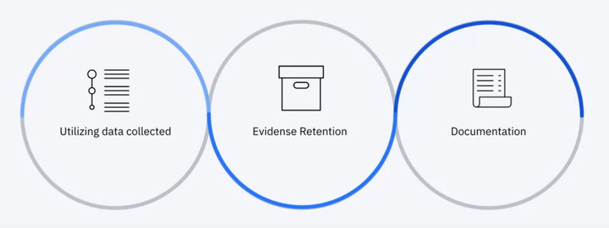

<!-- START doctoc generated TOC please keep comment here to allow auto update -->
<!-- DON'T EDIT THIS SECTION, INSTEAD RE-RUN doctoc TO UPDATE -->
**Table of Contents**   

- [Incident Response Overview](#incident-response-overview)
  - [What is Incident Response?](#what-is-incident-response)
  - [Why Incident Response is Important](#why-incident-response-is-important)
  - [Coordinating](#coordinating)
  - [Baseline Questions](#baseline-questions)
  - [NIST vs Sans Institute](#nist-vs-sans-institute)
- [Incident Response Process](#incident-response-process)
  - [1. Preparation](#1-preparation)
    - [1.1 Incident  Response Policy](#11-incident--response-policy)
    - [1.2 Resources](#12-resources)
    - [1.3 The best Offense](#13-the-best-offense)
    - [1.4 Checklist](#14-checklist)
    - [1.5 Importance of documentation](#15-importance-of-documentation)
  - [2. Dectection & Analysis](#2-dectection--analysis)
    - [2.1 Different between Precursors and Indicatiors and their common sources](#21-different-between-precursors-and-indicatiors-and-their-common-sources)
    - [2.2 Different types of monitoring systems used for detection](#22-different-types-of-monitoring-systems-used-for-detection)
    - [2.3 Importance of prioritization and documentation](#23-importance-of-prioritization-and-documentation)
    - [2.4 Notifications](#24-notifications)
  - [3. Containment, Eradication & Recovery](#3-containment-eradication--recovery)
    - [3.1 Containment](#31-containment)
    - [3.2 Forensics In Incident Response.](#32-forensics-in-incident-response)
    - [3.4 Eradication & Recovery](#34-eradication--recovery)
    - [3.5 Checklist](#35-checklist)
    - [3.6 Automation](#36-automation)
  - [4. Post-Incident Activity](#4-post-incident-activity)
    - [4.1 Lessons Learned](#41-lessons-learned)
    - [4.2 Post Incident Activities](#42-post-incident-activities)
    - [4.3 Reviewing the IR process](#43-reviewing-the-ir-process)
- [Incident Response Demo](#incident-response-demo)
  - [1. Incident Response Review](#1-incident-response-review)
    - [1.1 Common threats](#11-common-threats)
    - [1.2 Attack Vectors](#12-attack-vectors)
    - [1.3 IR Process](#13-ir-process)
    - [1.4 Demo](#14-demo)
  - [2. Apply Your knowledge from the demo](#2-apply-your-knowledge-from-the-demo)
    - [Virtual Lab Roadmaps](#virtual-lab-roadmaps)
    - [Virtual Lab: Using IBM QRadar SIEM](#virtual-lab-using-ibm-qradar-siem)
    - [Tools in Incident Response](#tools-in-incident-response)

<!-- END doctoc generated TOC please keep comment here to allow auto update -->

# Incident Response Overview

## What is Incident Response?

Before we can define what is it? Let's distinguish between an event and an incident.

| Events                                                                               | Incidents                                                                            |
|:------------------------------------------------------------------------------------:|:------------------------------------------------------------------------------------:|
|  |  |

An event can lead to incident so Incident response is defined according to NIST:

## Why Incident Response is Important

## Coordinating

## Baseline Questions

## NIST vs Sans Institute

T​he primary framework for the Incident Response process used in the course is from the National Institute of Standards and Technology, however the Sans institute also provides a framework not unlike the NIST. Take 10 minutes to read this article comparing and contrasting the two methodologies.

[https://cybersecurity.att.com/blogs/security-essentials/incident-response-steps-comparison-guide](https://cybersecurity.att.com/blogs/security-essentials/incident-response-steps-comparison-guide)

# Incident Response Process

## 1. Preparation

### 1.1 Incident  Response Policy

### 1.2 Resources

### 1.3 The best Offense

### 1.4 Checklist

### 1.5 Importance of documentation

D​ocumentation is one of the most important aspects of incident response and should be happening from start to finish. Take some time to read this article to shed light on how documentation impacts Incident Response.

[Documentation is to Incident Response as an Air Tank is to Scuba Diving | SANS Institute](https://www.sans.org/reading-room/whitepapers/incident/documentation-incident-response-air-tank-scuba-diving-2021)

## 2. Dectection & Analysis

### 2.1 Different between Precursors and Indicatiors and their common sources

### 2.2 Different types of monitoring systems used for detection

### 2.3 Importance of prioritization and documentation

Regardless of the monitoring system, highly detailed, thorough documentation is needed for current and future incidents.

### 2.4 Notifications

## 3. Containment, Eradication & Recovery

### 3.1 Containment

An assential part of containment is decision-making. Such decisions are much easier to make if there are predetermined strategies and procedures  for containing the incident.

### 3.2 Forensics In Incident Response.

### 3.4 Eradication & Recovery

### 3.5 Checklist

### 3.6 Automation

O​ne of the major challenges facing all fields in cybersecurity is the overwhelming increase of threats without a proportional increase in cybersecurity professionals to handle them. All signs point to automation as a lynch pin in helping mitigate the repetitive tasks and increase response time to events and threats. Read through this article on automation in Incident Response.

[Empowering Incident Response via Automation | SANS Institute](https://www.sans.org/reading-room/whitepapers/analyst/empowering-incident-response-automation-38862)

## 4. Post-Incident Activity

### 4.1 Lessons Learned

### 4.2 Post Incident Activities

### 4.3 Reviewing the IR process

R​ead the following case study of an incident response to a network based threat. Pay close attention to the steps taken in this study to put everything you've learned in this section in perspective.

[A Practical Example of Incident Response to a Network Based Attack | SANS Institute](https://www.sans.org/reading-room/whitepapers/incident/practical-incident-response-network-based-attack-37920)

# Incident Response Demo

## 1. Incident Response Review

### 1.1 Common threats

### 1.2 Attack Vectors

### 1.3 IR Process

### 1.4 Demo

[Videos](./videos)

## 2. Apply Your knowledge from the demo

### Virtual Lab Roadmaps

As a cybersecurity professional, you will be asked to use different products to apply your skill depending on the organization you work for currently or in the future. It is important to apply your skills to both open source products as well as specific products in the marketplace.

If this is the first time you are accessing the roadmap for the Cybersecurity courses developed by IBM, you will need to review and follow the instructions **to create an IBM ID**. If you have already accessed labs in other Cybersecurity courses, you will use your IBM ID associated with your email address.

Access the virtual lab for IBM QRadar using the "[Penetration testing, Incident Response and Forensics](https://www.securitylearningacademy.com/local/navigator/index.php?level=cvl001 "roadmap")" roadmap (Incident Response Demo):

### Virtual Lab: Using IBM QRadar SIEM

NOTE: **To create an IBM ID**, click the "Create IBM ID Account" in the top right corner. If you already have an IBM ID, select the RED Login button.

### Tools in Incident Response

R​ead this article to see what other tools are being used for Incident Response

[The 7 Best Free and Open-Source Incident Response Tools - Cynet](https://www.cynet.com/blog/the-7-best-free-and-open-source-incident-response-tools/)
