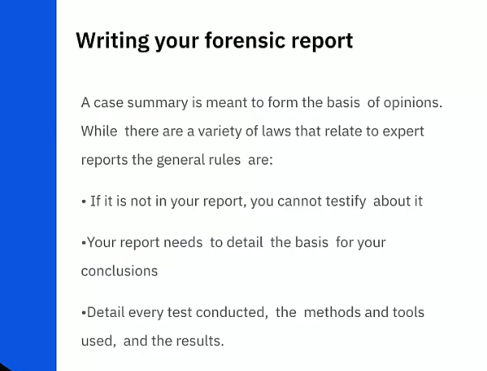

<!-- START doctoc generated TOC please keep comment here to allow auto update -->
<!-- DON'T EDIT THIS SECTION, INSTEAD RE-RUN doctoc TO UPDATE -->
**Table of Contents**   

- [Overview](#overview)
  - [What are Forensics?](#what-are-forensics)
  - [What types of data do forensics deal with?](#what-types-of-data-do-forensics-deal-with)
  - [What is the objective and need for digital forensics?](#what-is-the-objective-and-need-for-digital-forensics)
- [The Forensic Process](#the-forensic-process)
  - [1. Data Collection & Examination](#1-data-collection--examination)
    - [1.1 Collection | Steps to Collect Data](#11-collection--steps-to-collect-data)
    - [1.2 Oveview of Chain of Custody](#12-oveview-of-chain-of-custody)
    - [1.3 Examination](#13-examination)
  - [Reading | Handling Digital Evidence](#reading--handling-digital-evidence)
  - [2. Analysis & Reporting](#2-analysis--reporting)
    - [2.1 Analysis](#21-analysis)
    - [2.2 Reporting](#22-reporting)
    - [2.3 Report Writing Example](#23-report-writing-example)
  - [Forensics on Mobile devices](#forensics-on-mobile-devices)
- [Forensic Data](#forensic-data)
  - [Data Files](#data-files)
  - [Chances of Recovering Data](#chances-of-recovering-data)
  - [Operating System Data](#operating-system-data)
    - [Volatile vs Non-Volatile](#volatile-vs-non-volatile)
    - [What log information may be useful?](#what-log-information-may-be-useful)
  - [Application Data](#application-data)
    - [Different Components of an application - How they are meaningful to a forensic analyst.](#different-components-of-an-application---how-they-are-meaningful-to-a-forensic-analyst)
      - [Application Components](#application-components)
    - [Different types of application that provide meaningful forensic data.](#different-types-of-application-that-provide-meaningful-forensic-data)
    - [What considerations are taken when collecting application data.](#what-considerations-are-taken-when-collecting-application-data)
  - [Network Data](#network-data)
    - [TCP/IP Basic relates to Forensics](#tcpip-basic-relates-to-forensics)
    - [Different sources of network traffic](#different-sources-of-network-traffic)
    - [How to examining and analyzing network traffic](#how-to-examining-and-analyzing-network-traffic)
- [Forensic Labs](#forensic-labs)
  - [Beginner Digital Forensics Lab](#beginner-digital-forensics-lab)
  - [Advanced Digital Forensics Lab review](#advanced-digital-forensics-lab-review)

<!-- END doctoc generated TOC please keep comment here to allow auto update -->

# Overview

## What are Forensics?

According to NIST 800-86:

## What types of data do forensics deal with?

The first step in the forensic process is to identify potential sources of data and acquire data from the. The most obvious and common sources of data are desktop computers. servers, network storage devices, and laptops.

## What is the objective and need for digital forensics?

- The need for digital forensics:
  
  

- Objectives of Digital Forensics
  
  

# The Forensic Process

 

## 1. Data Collection & Examination

### 1.1 Collection | Steps to Collect Data

### 1.2 Oveview of Chain of Custody

### 1.3 Examination

## Reading | Handling Digital Evidence

T​o expand further on the importance of preserving digital evidence that has been collected, pease review the sample chain of custody document, the NIST page on digital evidence, and read the article on forensics in the court of law.

[Sample Chain of Custody Form](https://d3c33hcgiwev3.cloudfront.net/MFli6aDSTx2ZYumg0n8drQ_b9de5a73184243d8bcf40588bdf907de_Sample-Chain-of-Custody-Form-1-.docx?Expires=1659744000&Signature=ANdKmFycgzUucLfuaToQaIGaiRYJImHp56xTT-iDMfVc1muOIz3KALr3lWwzSPen3NOmn3LKPgw18-wT3D9DuQsXTvcKSLtTAa3BCXu3JuvHsJV~tp4B07crni5w~LNpxZpl9oXg~ZEb51d~Yq61hJqgLM2jIC2HFN9ee97BvGI_&Key-Pair-Id=APKAJLTNE6QMUY6HBC5A)

[Digital Evidence and the U.S. Criminal Justice System](https://www.ncjrs.gov/pdffiles1/nij/grants/248770.pdf)

[DIGITAL EVIDENCE](https://www.nist.gov/topics/digital-evidence)

## 2. Analysis & Reporting

### 2.1 Analysis

`Solved with forensics`

### 2.2 Reporting

`Report Composition`

Sans Institute Best Practices using for step3[Analysis] on `Report Composition`

### 2.3 Report Writing Example

T​o see what an example of a written report looks like, review this link:

 [Cyber Security Blog | SANS Institute](https://www.sans.org/blog/intro-to-report-writing-for-digital-forensics/)

## Forensics on Mobile devices

W​hile the vast majority of this module is focused on network and computer data, there is another entire focus of conducting forensic analysis on mobile devices. So much so, it's out of scope of this training to go into all the details but given the ubiquity of mobile devices it remains important to educate yourself of resources down the road. Review the following articles and save them for future reference.

[mobile-security-and-forensics](https://csrc.nist.gov/projects/mobile-security-and-forensics)

[NIST.SP.800-101r1](https://nvlpubs.nist.gov/nistpubs/SpecialPublications/NIST.SP.800-101r1.pdf)

# Forensic Data

## Data Files

`Different File Systems`

A filesystem defines the way that files are named, stored, organized, and successed on logical volumes.

`Intangible | What not there`

Another type of information we can get from file `MAC data`

How to we collect data? | two major camps in collecting files.

|  |  |
| ------------------------------------------------------------------------------ | --------------------------------------------------------------------------------------------------------------------------------- |

`Tools for techniques`

Many forensic products allow the analyst to perform a wide range of processes to analyze fues and appliations, as well as collecting files, reading disk images, and extracting data from files.

List below tools helpful for you.

## Chances of Recovering Data

N​ow that you've brushed up on files and filesystems, take some time to review the challenges of recovering data from them.

 [Lost files: What are the chances to recover them?](https://www.ufsexplorer.com/articles/chances-for-data-recovery.php)

## Operating System Data

### Volatile vs Non-Volatile

From knowledges previous pic, we always want to start with collecting the volatile data. Because we not know how much longer we'll have access to it.

| Collecting Non-Volatile Data                                                                                                      | Collecting Volatile data                                                                                                          |
| --------------------------------------------------------------------------------------------------------------------------------- | --------------------------------------------------------------------------------------------------------------------------------- |
|  |  |

E:\Hacking_Courses\IBM_CyberSecurity\images\2022-08-05-08-00-31-image.png

### What log information may be useful?

## Application Data

### Different Components of an application - How they are meaningful to a forensic analyst.

#### Application Components

- **`Config Settings`**| Store in 3 ways
  
  - Configuration File
  
  - Runtine Options
  
  - Added to Source Code

- **`Authentication`**
  
  - External Authentication
  
  - Proprietary Authentication
  
  - Pass-Through Authentication
  
  - Host/Users Environment

- **`Logs`**
  
  - Event 
  
  - Audit
  
  - Error
  
  - Insatllation
  
  - Debugging

- **`Data`**
  
  - Can live temporarily in memory and/or permanently in files
  
  - File format may be generic or proprietary
  
  - Data may be stored in databases
  
  - Some applications create temp files during session or improper shutdown

- **`Supporting Files`**
  
  - Documentation
  
  - Links
  
  - Graphics

- **`App Architecture`**
  
  - Local
  
  - Client/Server
  
  - Peer2peer

### Different types of application that provide meaningful forensic data.

**`Types of Applications`**

- Email
  
  

- Web Usage

- Interactive Communications
  
  

### What considerations are taken when collecting application data.

## Network Data

### TCP/IP Basic relates to Forensics

### Different sources of network traffic

### How to examining and analyzing network traffic

# Forensic Labs

## Beginner Digital Forensics Lab

F​ollow this link to participate in a mock digital forensic analysis. Instructions and materials are linked on the page.

[Digital Forensics Challenge](https://pivotproject.org/challenges/digital-forensics-challenge)

## Advanced Digital Forensics Lab review

T​his is another lab, but much more involved than the first. Given the complexity, instead of trying to solve, we encourage you to read all the details, the questions, AND the answers to see how it was resolved.

[Advance Digital Forensics Review](https://digital-forensics.sans.org/community/challenges)
