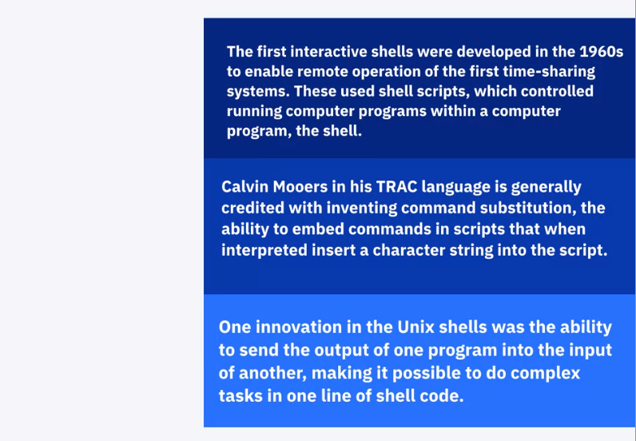
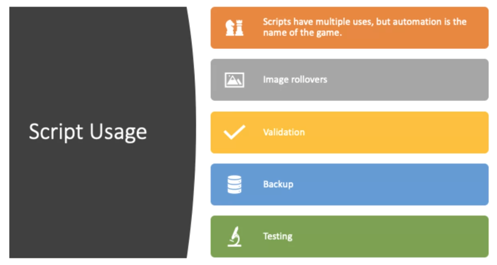

<!-- START doctoc generated TOC please keep comment here to allow auto update -->
<!-- DON'T EDIT THIS SECTION, INSTEAD RE-RUN doctoc TO UPDATE -->
**Table of Contents**   

- [Overview](#overview)
  - [History of Scripting](#history-of-scripting)
  - [Scripting Concepts & Scripting Languages](#scripting-concepts--scripting-languages)
- [Scripting in CyberSecurity](#scripting-in-cybersecurity)
  - [Coding in Cybersecurity](#coding-in-cybersecurity)
  - [Scripts to Mitigate Risks](#scripts-to-mitigate-risks)
  - [Bash Scripting in Penetration Testing](#bash-scripting-in-penetration-testing)
  - [Using Python in Forensics](#using-python-in-forensics)
- [Python Scripting](#python-scripting)
- [Becoming System Administration with Sans](#becoming-system-administration-with-sans)

<!-- END doctoc generated TOC please keep comment here to allow auto update -->

# Overview

## History of Scripting

**`What do we use the scripts for? | Usage`**

## Scripting Concepts & Scripting Languages

- [Download video and sub at here](./videos)

# Scripting in CyberSecurity

## Coding in Cybersecurity

T​his is a great overview for understanding the broad appeal of having coding skills for a position in the cybersecurity field.

[A guide to learning computer code for cybersecurity](https://cybersecurityguide.org/resources/coding-for-cybersecurity/ "Coding in Cybersecurity")

## Scripts to Mitigate Risks

Review this article on how scripting is being used to help mitigate threats and risks

[cripts-exploit-mitigate-risks](https://www.sans.org/reading-room/whitepapers/scripting/scripts-exploit-mitigate-risks-1313)

## Bash Scripting in Penetration Testing

B​ash scripting is one of the easier scripting languages to pickup and has particular benefit for penetration testers. Review this article to see what can be accomplished with bash!

[Basic Bash Scripting &#8211; Pen Testing](https://pentestforbeginners.blog/2018/05/30/basic-bash-scripting/)

## Using Python in Forensics

T​his article is a great overview on the different forensic techniques achieved using python scripting.

[Python Programming for Digital Forensics vs Security Analysis](https://opensourceforu.com/2016/11/python-programming-digital-forensics-security-analysis/)

# Python Scripting

A cybersecurity analyst needs to understand scripting and its uses. You may want to learn more about Python scripting if you pursue other roles within Information Technology or as you gain more experience as a Cybersecurity professional.

Here are several additional resources available:

Python website: [https://www.python.org/](https://www.python.org/)

Python Basics Beginners Guide: [https://wiki.python.org/moin/BeginnersGuide](https://wiki.python.org/moin/BeginnersGuide)

w3schools.com script training and exercises: [Python Tutorial](https://www.w3schools.com/python/default.asp)

Python for Data Sciences (Free Course): [https://cognitiveclass.ai/courses/python-for-data-science/](https://cognitiveclass.ai/courses/python-for-data-science/)

Python for Data and AI (Coursera Course) [https://www.coursera.org/learn/python-for-applied-data-science-ai?specialization=ibm-data-science](https://www.coursera.org/learn/python-for-applied-data-science-ai?specialization=ibm-data-science)

# Becoming System Administration with Sans

[Cyber Aces - System Administration | SANS Institute](https://www.sans.org/cyberaces/system-administration/)[Cyber Aces - System Administration | SANS Institute](https://www.sans.org/cyberaces/system-administration/)

